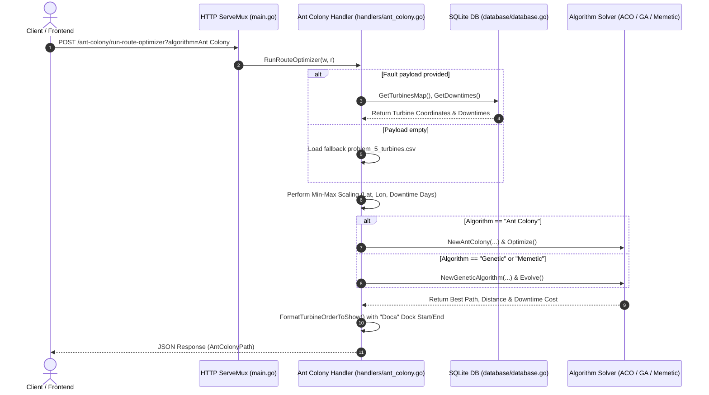

# Project Context & Architecture

This document serves as the primary technical reference and architectural blueprint for the **Ant Colony & Metaheuristics Golang Backend** workspace.

---

## 1. Project Overview

* **Purpose**: A ultra-high-performance Go microservice designed for optimizing offshore wind farm turbine maintenance routing. Replicated from the original Python FastAPI backend, it computes optimal navigation routes using bio-inspired metaheuristic algorithms (Ant Colony Optimization, Genetic Algorithms, and Memetic Algorithms), balancing travel distance against turbine fault downtime costs.
* **Target Audience**: Operational planners, wind farm maintenance engineers, and researchers needing low-latency scheduling and route optimization.
* **Context**: Developed as part of an offshore wind farm maintenance research project (TCC) to evaluate language speed gains and provide a production-ready API for web dashboards (e.g., React / Vite / Next.js).

---

## 2. Tech Stack

* **Core Language**: Go 1.24+
* **Web Server & Routing**: Standard Library `net/http` with custom CORS middleware
* **Database & Storage**: SQLite, `database/sql`, [`github.com/mattn/go-sqlite3`](https://github.com/mattn/go-sqlite3)
* **Optimization & Data Processing**:
  * Pure Go mathematical vector calculations (`math`, `math/rand`, `sort`)
  * Concurrent execution model using standard library primitives
* **Data Serialization**: `encoding/json`, `encoding/csv`
* **Testing & Benchmarking**: `testing` package, `httptest` HTTP recorder, Python comparative runner (`tests/compare_backends.py`)

---

## 3. Architecture & Directory Structure

```
ant_colony_golang_backend/
├── algorithms/                 # Core metaheuristic solvers package
│   ├── aco.go                  # Ant Colony Optimization (ACO) implementation
│   ├── ga.go                   # Genetic & Memetic (GA + 2-opt) implementation
│   ├── common.go               # Distance metrics, cost functions, route formatting
│   └── algorithms_test.go      # Unit tests for solvers
├── database/                   # Database interface & SQL seeding package
│   ├── database.go             # SQLite connection initialization & query functions
│   ├── database.sql            # Seed ANSI SQL DDL & DML script
│   ├── downtime.csv            # Subsystem fault downtime dataset
│   ├── subsystem.csv           # Subsystem definitions dataset
│   └── wind_farm_map_points.csv# Geographical turbine map dataset
├── handlers/                   # HTTP Request Handlers package
│   ├── ant_colony.go           # Route handlers (/ant-colony/*) & CSV parser
│   └── handlers_test.go        # HTTP endpoint integration tests (httptest)
├── models/                     # Data structures & JSON DTO definitions
│   └── models.go               # Struct definitions (AntColonyMap, TurbineFaults, etc.)
├── tests/                      # Benchmarking & performance comparison suite
│   ├── inputs/                 # Problem datasets (5 to 100 turbines CSVs)
│   │   ├── problem_5_turbines.csv
│   │   ├── problem_10_turbines.csv
│   │   ├── problem_15_turbines.csv
│   │   ├── problem_20_turbines.csv
│   │   ├── problem_40_turbines.csv
│   │   └── problem_100_turbines.csv
│   ├── benchmarks_test.go      # Go benchmark test suite (testing.B)
│   └── compare_backends.py     # Python script benchmarking FastAPI vs Go
├── go.mod                      # Go module definition
├── go.sum                      # Dependency checksums
├── main.go                     # Server entrypoint & CORS middleware configuration
├── README.md                   # Project documentation & quick start guide
└── CONTEXT.md                  # Comprehensive technical reference (this file)
```

### Component & Data Models Breakdown

#### Data Models (`models/models.go`)
* **`AntColonyMap`**: Struct representing wind farm turbine geographical entries (`TurbineID`, `TurbineName`, `Latitude`, `Longitude`).
* **`Subsystems`**: Struct defining wind turbine subsystem metadata (`SubsystemID`, `SubsystemName`).
* **`Downtime`**: Struct capturing failure downtime profiles (`SubsystemID`, `SubsystemName`, `FaultType`, `AnualFailureRate`, `FaultDowntimeDays`).
* **`TurbineFaults`**: Incoming API request payload DTO representing reported faults on turbines (`TurbineID`, `TurbineName`, `SubsystemName`, `FaultType`).
* **`AntColonyPath`**: API response DTO containing optimization results (`TurbineOrder`, `TurbineOrderToShow`, `BestPath`, `BestPathLength`, `BestDowntimeDays`, `BestPathLenDowntime`, `TimeToRunSec`).
* **`TurbineFaultPoint`**: Internal normalized operational entity carrying both raw and Min-Max normalized coordinates (`LatitudeNorm`, `LongitudeNorm`, `FaultDowntimeDaysNorm`).

#### Database Package (`database/database.go`)
* **`InitDB(dbPath, sqlPath)`**: Automatically checks table existence (`SELECT count(*) FROM sqlite_master WHERE type='table' AND name='wind_farm_map_points'`) and initializes schema and seed data from `database/database.sql`. Supports in-memory testing (`:memory:`).
* **Queries**: `GetTurbinesMap()`, `GetSubsystems()`, `GetDowntimes()` querying `wind_farm_map_points`, `subsystem`, and `downtime` tables.

#### Core Algorithms (`algorithms/`)
* **`algorithms/aco.go`**: Multi-colony Ant Colony Optimization with probabilistic roulette-wheel selection and pheromone matrix evaporation/deposition.
* **`algorithms/ga.go`**: Genetic Algorithm with Order Crossover (OX), swap mutation, elitist truncation selection, and optional 2-Opt local search (Memetic mode).
* **`algorithms/common.go`**: Shared Euclidean distance, downtime cost calculation, objective evaluation, and `FormatTurbineOrderToShow` cycle rotation logic.

---

## 4. Core Workflows & Heuristics



### Adaptive Hyperparameter Rules

| Algorithm | Problem Scale ($N$) | Population / Ants | Iterations / Generations | Mutation / Exploration | Local Search (2-Opt) |
| :--- | :--- | :--- | :--- | :--- | :--- |
| **Ant Colony** | $N \le 10$ | $m = 3$ | 200 | $\alpha = 5.0, \beta = 1.5, \rho = 0.5, Q = 100$ | — |
| **Ant Colony** | $N > 10$ | $m = 8$ | 200 | $\alpha = 5.0, \beta = 2.0, \rho = 0.5, Q = 100$ | — |
| **Genetic** | $N < 15$ | 50 | 50 | Mutation rate: 0.2 | — |
| **Genetic** | $N \ge 15$ | 100 | 50 | Mutation rate: 0.1 | — |
| **Memetic** | $N < 40$ | 50 | 10 | Mutation rate: 0.2 | 2-opt ($p=0.2$, 10 iter) |
| **Memetic** | $N \ge 40$ | 150 | 50 | Mutation rate: 0.1 | 2-opt ($p=0.2$, 10 iter) |

---

## 5. Mathematical Formulations

### Min-Max Feature Scaling

For coordinate normalization across latitude, longitude, and downtime days:

$$x_{\text{norm}} = \frac{x - x_{\text{min}}}{x_{\text{max}} - x_{\text{min}}}$$

### Objective Cost Function

Total cost for route $P = [p_0, p_1, \dots, p_k]$:

$$f(P) = \sum_{i=0}^{k-1} d(p_i, p_{i+1}) + \sum_{i=0}^{k-1} c(downtime_i, downtime_{i+1})$$

Where Euclidean distance $d(p_1, p_2)$ is:

$$d(p_1, p_2) = \sqrt{(lat_1 - lat_2)^2 + (lon_1 - lon_2)^2}$$

And downtime cost $c(d_1, d_2)$ is:

$$c(d_1, d_2) = d_1 + d_2$$

### Ant Colony Transition Probability

The probability $p_{ij}^k$ of ant $k$ moving from turbine $i$ to unvisited turbine $j$ is:

$$p_{ij}^k = \frac{[\tau_{ij}]^\alpha \cdot [\eta_{ij}]^\beta}{\sum_{l \in \text{unvisited}} [\tau_{il}]^\alpha \cdot [\eta_{il}]^\beta}$$

Where visibility $\eta_{ij}$ combines distance and downtime cost:

$$\eta_{ij} = \frac{1}{d(p_i, p_j) + c(d_i, d_j) + \epsilon}$$

### Pheromone Evaporation & Deposition

Evaporation occurs globally across all edges, while deposition is applied along the traversed edges of each ant's closed tour:

$$\tau_{ij} \leftarrow (1 - \rho)\tau_{ij} + \sum_{k: (i,j) \in P_k} \frac{Q}{f(P_k)}$$

$$\tau_{ij} \leftarrow \max(\tau_{ij}, 10^{-6})$$

---

## 6. Development & Operations Guide

### Building and Running Locally

```bash
# Fetch dependencies
go mod download

# Run server
go run main.go

# Build binary
go build -o server main.go
./server
```

### Running Test Suite

```bash
# Run unit & handler integration tests (using in-memory SQLite)
go test -v ./...

# Run Go algorithm benchmark suite
go test -v ./tests

# Run comparative benchmark runner against Python FastAPI
python tests/compare_backends.py
```

---

## 7. Performance Benchmarks Summary

### Algorithm Execution Speed Gain (Go vs Python)

* **Ant Colony Optimization (ACO)**: ~**58x to 90x faster** in Go across problem sizes (5 to 40 turbines).
* **Genetic Algorithm (GA)**: ~**57x to 88x faster** in Go across problem sizes.
* **Memetic Algorithm (GA + 2-opt)**: ~**72x to 138x faster** in Go (e.g., 40 turbines completes in `1.21s` in Go vs `148.2s` in Python).

### HTTP API Latency Reduction

* **Endpoint Latency**: End-to-end API response time reduced by **11.7x to 26.1x** for route optimization POST requests.
